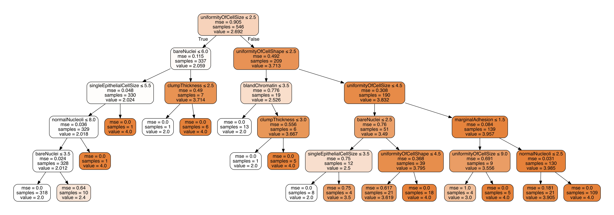

## Preparing data
In [Breast Cancer Wisconsin (Prognostic) Data Set](https://archive.ics.uci.edu/ml/datasets/Breast+Cancer+Wisconsin+%28Prognostic%29)
 Each record represents follow-up data for one breast cancer case. These are consecutive
patients seen by Dr. Wolberg since 1984, and include only those cases exhibiting
invasive breast cancer and no evidence of distant metastases at the time of diagnosis. 

These are attributes that sample-code-number is just an ID and we don't count it a feature,
and the class attribute is our output for  regression. 

       #  Attribute                     Domain
       -- -----------------------------------------
       1. Sample code number            id number
       2. Clump Thickness               1 - 10
       3. Uniformity of Cell Size       1 - 10
       4. Uniformity of Cell Shape      1 - 10
       5. Marginal Adhesion             1 - 10
       6. Single Epithelial Cell Size   1 - 10
       7. Bare Nuclei                   1 - 10
       8. Bland Chromatin               1 - 10
       9. Normal Nucleoli               1 - 10
       10. Mitoses                      1 - 10
       11. Class:                       (2 for benign, 4 for malignant)
       
First of all we need to remove the Data that have missing values (16 row).

# Analysis

## References
* [What is Logistic Regression?](https://www.statisticssolutions.com/what-is-logistic-regression/)
* [sklearn.linear_model.LogisticRegression](http://scikit-learn.org/stable/modules/generated/sklearn.linear_model.LogisticRegression.html)
* [Linear Discriminant Analysis ](https://sebastianraschka.com/Articles/2014_python_lda.html)
* [sklearn.discriminant_analysis.LinearDiscriminantAnalysis](http://scikit-learn.org/stable/modules/generated/sklearn.discriminant_analysis.LinearDiscriminantAnalysis.html)
* [Quadratic Discriminant Analysis (QDA)](https://onlinecourses.science.psu.edu/stat857/node/80/)
* [sklearn.discriminant_analysis.QuadraticDiscriminantAnalysis](http://scikit-learn.org/stable/modules/generated/sklearn.discriminant_analysis.QuadraticDiscriminantAnalysis.html)
* [Data Mining - Naive Bayes (NB)](https://gerardnico.com/data_mining/naive_bayes )
* [sklearn.naive_bayes.GaussianNB](http://scikit-learn.org/stable/modules/generated/sklearn.naive_bayes.GaussianNB.html)

