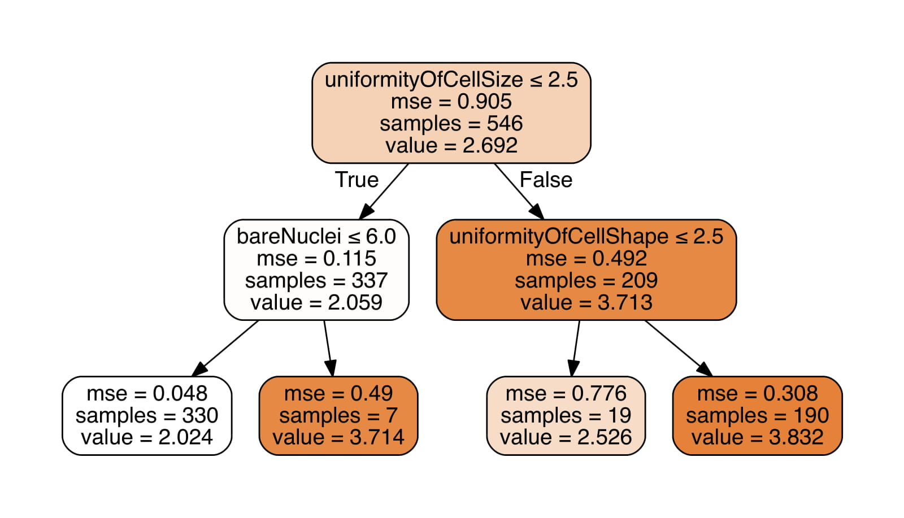

## Preparing data
In [Breast Cancer Wisconsin (Prognostic) Data Set](https://archive.ics.uci.edu/ml/datasets/Breast+Cancer+Wisconsin+%28Prognostic%29)
 Each record represents follow-up data for one breast cancer case. These are consecutive
patients seen by Dr. Wolberg since 1984, and include only those cases exhibiting
invasive breast cancer and no evidence of distant metastases at the time of diagnosis. 

These are attributes that sample-code-number is just an ID and we don't count it a feature,
and the class attribute is our output for  regression. 

       #  Attribute                     Domain
       -- -----------------------------------------
       1. Sample code number            id number
       2. Clump Thickness               1 - 10
       3. Uniformity of Cell Size       1 - 10
       4. Uniformity of Cell Shape      1 - 10
       5. Marginal Adhesion             1 - 10
       6. Single Epithelial Cell Size   1 - 10
       7. Bare Nuclei                   1 - 10
       8. Bland Chromatin               1 - 10
       9. Normal Nucleoli               1 - 10
       10. Mitoses                      1 - 10
       11. Class:                       (2 for benign, 4 for malignant)
       
First of all we need to remove the Data that have missing values (16 row).

# Analysis
## Regression Tree
    
    MSE : 0.16684800460672927
    R^2 score : 0.8200247012377183
    

## Decision Tree
A decision tree is a decision support tool that 
uses a tree-like model of decisions and their possible
consequences, including chance event outcomes, resource costs,
and utility. It is one way to display an algorithm that only
contains conditional control statements.

    MSE : 0.24077872707426434
    R^2 score : 0.7402772454909846

In the regression and decision tree, the uniformity of cellsize  is 
located at the highest point, so we can conclude that it has the most importance among the features.

# Bagging 

        
    Confusion matrix : [[85  3]
     [ 2 47]]
    MSE : 0.145985401459854
    Accuracy : 0.9635036496350365
    R^2 score : 0.8425287356321839
    
# SVM
        
    Confusion matrix : [[83  2]
     [ 4 48]]
    MSE : 0.17518248175182483
    Accuracy : 0.9562043795620438
    R^2 score : 0.8110344827586207
    
    
# Random forrest

    Confusion matrix : [[84  4]
     [ 3 46]]
    MSE : 0.20437956204379562
    Accuracy : 0.948905109489051
    R^2 score : 0.7795402298850574
    
    
# Conclusion

MSE :      ` Bagging  <  SVM  <  Random forest`
Accuracy :    `Bagging  >  SVM  > Random forest`

According to the obtained values, we can conclude that the Bagging method is the best method.

According to the values for the classification are better, we can conclude that the decision border is almost linear.

## Comparison with Project 1
[Project 1 results](../assignment1) 
Compare by       :        `multiple linear regression  > regression tree`
Based on the obtained values , we can conclude that the multiple linear regression  method is better.

## Comparison with Project 2 
[Project 2 results](../assignment2) 

* Compare by    r2 
    `decision tree  <  QDA  < LDA  < logistic regression` 
According to the obtained values of  , we can conclude that the methods used in the second project are more efficient than the decision tree, Because the  value in the decision tree is smaller. 

* Compare by MSE   
      `decision tree  >  QDA  > LDA  > logistic regression`
According to the obtained values of  MSE, we can conclude that the methods used in the second project are more efficient than the decision tree, Because the MSE value in the decision tree is bigger.

## References

